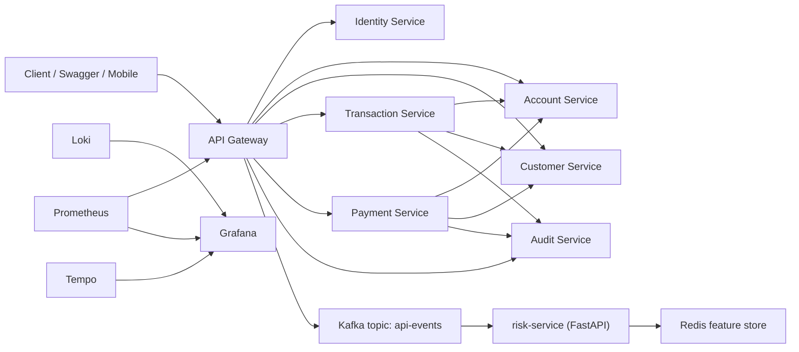

# Gateway Pattern Banking Platform

Production-style digital banking platform built to teach how a serious microservice system is designed, secured, observed, tested, and explained.

## Why This Repository Exists

Most gateway and microservice tutorials stop at CRUD and a reverse proxy. Real companies do not.

This project is intentionally shaped like a small banking platform so we can learn:

- where an `API Gateway` should help and where it should stay out of business logic
- how service boundaries protect ownership and reduce chaos
- why authentication, audit, idempotency, and traceability matter in financial systems
- how synchronous business calls and asynchronous event streams work together
- how observability, CI, and smoke validation turn code into an operable system

The goal is not to build a toy demo. The goal is to build a reference project that a hiring manager, senior engineer, or platform team can take seriously.

## What The Platform Does Today

- React frontend for client and operator workflows (MSW-mocked or live against the gateway)
- login and JWT issuance through `identity-service`
- self-service account creation through `account-service`
- customer eligibility and KYC lookup through `customer-service`
- transfer orchestration with double-entry ledgering through `transaction-service`
- payment orchestration through `payment-service`
- synchronous audit event recording through `audit-service`
- gateway-published Kafka security events consumed by the Python `risk-service`
- explainable, AI-augmented risk scoring with a Redis feature store
- DB-backed idempotency for transfers and payments
- `Prometheus + Grafana + Tempo + Loki` observability stack (gateway instrumented today)
- CI pipeline that verifies every service on each push

## Roadmap (Documented, Not Yet Built)

These are planned phases, described here honestly instead of being claimed as done:

- per-service `PostgreSQL` persistence (services currently use H2 file storage)
- per-service Prometheus/OTel instrumentation (only the gateway is instrumented today)
- `Outbox Pattern` and event-driven audit/notification publication
- `notification-service` (referenced in early phase specs, not implemented yet)
- resilience patterns: circuit breakers, retry with backoff (see `docs/adr/ADR-002-synchronous-internal-rest.md`)
- Testcontainers-based integration tests for the transfer/payment flows
- Kubernetes application-layer manifests

## High-Level Architecture



## Service Boundaries

### `api-gateway`

Single client entry point.

Responsibilities:

- routing
- shared traffic policy
- token-aware edge behavior
- correlation propagation
- publishing API security events to Kafka

### `identity-service`

Authentication boundary.

Responsibilities:

- username/password authentication
- JWT creation
- current-user resolution from bearer token

### `account-service`

Account and balance boundary.

Responsibilities:

- account creation
- account lookup
- IBAN ownership
- debit/credit posting

### `customer-service`

Customer eligibility boundary.

Responsibilities:

- customer profile
- KYC state
- risk rating
- transfer/payment eligibility support

### `transaction-service`

Transfer orchestration boundary.

Responsibilities:

- source account verification
- target IBAN verification
- transfer settlement initiation
- double-entry ledger records
- idempotency and rapid duplicate protection

### `payment-service`

Payment orchestration boundary.

Responsibilities:

- debtor account verification
- payment debit orchestration
- idempotency handling

### `audit-service`

Compliance and audit boundary.

Responsibilities:

- audit feed
- security/event history

### `risk-service`

Security intelligence boundary (Python/FastAPI).

Responsibilities:

- consuming gateway API events from Kafka
- real-time feature extraction with Redis
- explainable risk decisions (`allow / monitor / review / step_up / block`)

## Runtime Stack

### Business and Infrastructure

- `Spring Boot 4` on `Java 21`
- `Spring Cloud Gateway` (server-webmvc variant)
- `Spring Security` with HMAC JWT validation
- `Spring Data JPA` on H2 file storage (PostgreSQL per service is the roadmap target)
- `Apache Kafka` for the gateway security-event stream
- `Redis` as the risk-service feature store
- `Docker Compose` for the full local runtime

### Observability

- `Prometheus` for metrics collection (gateway scrape target today)
- `Grafana` for dashboards
- `Tempo` for traces (gateway OTLP exporter today)
- `Loki` + `Promtail` for logs
- `OpenTelemetry` via Micrometer tracing bridge

## Documentation Map

- [docs/architecture/system-overview.md](docs/architecture/system-overview.md)
- [docs/architecture/system-design.md](docs/architecture/system-design.md)
- [docs/architecture/port-route-plan.md](docs/architecture/port-route-plan.md)
- [docs/architecture/faz4-business-flows.md](docs/architecture/faz4-business-flows.md)
- [docs/architecture/faz5-service-communication.md](docs/architecture/faz5-service-communication.md)
- [docs/architecture/service-catalog.md](docs/architecture/service-catalog.md)
- [docs/architecture/failure-scenarios.md](docs/architecture/failure-scenarios.md)
- [docs/security/security-foundation.md](docs/security/security-foundation.md)
- [docs/adr](docs/adr)

## Quick Start

### 1. Start the platform

Every service ships its own Dockerfile; Docker Compose builds them.

```bash
docker compose -f infra/docker/docker-compose.yml up -d --build
```

### 2. Open the main UIs

- [Grafana](http://localhost:3000)
- [Prometheus](http://localhost:9090)
- [Gateway Health](http://localhost:8090/actuator/health)
- [Identity Swagger](http://localhost:8081/swagger-ui/index.html)
- [Account Swagger](http://localhost:8082/swagger-ui/index.html)
- [Customer Swagger](http://localhost:8083/swagger-ui/index.html)
- [Transaction Swagger](http://localhost:8084/swagger-ui/index.html)
- [Payment Swagger](http://localhost:8085/swagger-ui/index.html)
- [Audit Swagger](http://localhost:8086/swagger-ui/index.html)
- [Risk Service](http://localhost:8091/health)

### 3. Run the banking smoke test

```bash
bash infra/local/phase6-banking-smoke-test.sh
```

### 4. Run the frontend locally

```bash
cd frontend
pnpm install
pnpm msw:init
pnpm dev --host 127.0.0.1
```

The frontend is configured by `frontend/.env.local`.

- `VITE_USE_MOCKS=true` runs the UI fully against MSW mock handlers (no backend needed).
- `VITE_USE_MOCKS=false` connects the UI to the real API Gateway.
- `VITE_API_GATEWAY_URL=http://localhost:8090` points the browser to the backend.

### 5. Run frontend checks

```bash
cd frontend
pnpm typecheck
pnpm build
pnpm e2e
```

The E2E suite uses `frontend/.env.e2e`, so it can validate the UI flow against mock data without requiring the full backend stack.

Note: the operator `Platform health` screen currently reads from the mock handlers; the gateway-side aggregation endpoint is a roadmap item.

## Security Event Stream

The `api-gateway` publishes one API security event for every completed gateway request.
Events are sent to Kafka topic `api-events` and form the data foundation for the risk-service.

Topic:

```text
api-events
```

Event contract:

```json
{
  "eventId": "b4f8d8c6-94d1-4e34-a3a6-4e08391f3f5f",
  "timestamp": "2026-04-26T10:15:30.123Z",
  "correlationId": "3b41b6e5-7395-4d0f-8e32-7dfd75d4fd4b",
  "userId": "cust-1002",
  "username": "yavuz",
  "role": "CUSTOMER",
  "ipAddress": "127.0.0.1",
  "userAgent": "Mozilla/5.0 ...",
  "endpoint": "/api/v1/accounts/me",
  "httpMethod": "GET",
  "statusCode": 200,
  "responseTimeMs": 34,
  "serviceName": "api-gateway"
}
```

Why it exists:

- it turns live API traffic into a security data stream
- it keeps request identity, endpoint, status, latency, and correlation metadata together
- it gives the risk-service a stable event contract
- it supports auditability without putting risk logic inside the gateway

## Risk Service

The `risk-service` is a Python FastAPI service that consumes gateway API events from Kafka and produces an explainable AI-augmented risk decision.
It uses Redis as a real-time feature store so each decision can include recent behavior, not only the current request.
In this phase it observes and evaluates traffic only; it does not block gateway requests yet.

Runtime endpoints:

```text
GET  /health
GET  /risk/stats
GET  /risk/decisions?limit=25
POST /risk/evaluate
```

Local URLs:

```text
http://localhost:8091/health
http://localhost:8091/risk/stats
http://localhost:8091/risk/decisions?limit=10
```

Decision levels:

```text
allow   -> normal request
monitor -> elevated but not critical
review  -> suspicious enough for operator review
step_up -> high risk; future gateway phase should require MFA/SCA
block   -> critical risk; future gateway phase can temporarily deny
```

The composite score combines two signals:

```text
riskScore = 0.60 * ruleScore + 0.40 * mlScore
```

`ruleScore` is deterministic and explainable. It considers:

- HTTP status code
- gateway response time
- anonymous access to non-actuator endpoints
- sensitive banking endpoints such as accounts, transactions, payments, and ops
- request frequency in the last 1 and 5 minutes
- failed request count in the last 5 minutes
- endpoint diversity per user
- distinct IP count per user
- distinct user count per IP
- rapid repeat requests
- off-hours sensitive access

`mlScore` is produced by a versioned anomaly profile under:

```text
services/risk-service/models/v1.0.0/
  model.json
  feature_schema.json
  metrics.json
  model_card.md
```

The model is trained from deterministic synthetic banking API traffic:

```bash
cd services/risk-service
PYTHONPATH=. python scripts/train_anomaly_model.py
```

This is intentionally described as AI-augmented anomaly detection, not a production fraud model. The output remains audit-friendly because each decision includes `ruleScore`, `mlScore`, `modelVersion`, `reasons`, and `topFactors`.

Redis feature keys are TTL-based and intentionally short-lived. This keeps the system fast and privacy-aware for local demo purposes.

Why it exists:

- it separates security analysis from request routing
- it lets Java microservices keep business ownership while Python owns risk intelligence
- it adds a versioned ML anomaly signal without hiding the deterministic rule score
- it creates a clear extension point for adaptive gateway response in later phases
- it keeps decisions explainable, which matters for banking audit and compliance-aware systems

## Demo Story

The strongest demo path is:

1. login as `yavuz`
2. create Yavuz account
3. login as `fatih`
4. create Fatih account
5. transfer from Yavuz to Fatih using Fatih's real IBAN
6. create a payment from Fatih
7. verify audit side effects
8. prove the traffic in Prometheus, logs in Loki, and traces in Tempo
9. show the risk-service decisions for the generated traffic

## Authentication Model

`identity-service` issues HMAC-signed JWTs (HS256) after username/password login.
The gateway and every downstream service validate the same token with a shared secret and map the `role` claim to authorization decisions.

This is a deliberate teaching-grade model:

- it keeps the token flow visible and easy to debug
- it avoids hiding the learning goal behind an external identity provider
- the trade-offs (shared-secret distribution, no key rotation, no refresh tokens) are documented in `docs/adr/ADR-004-hmac-jwt-over-keycloak.md` and `docs/security/security-foundation.md`

## Why Companies Use These Patterns

### `API Gateway`

Companies use a gateway to centralize traffic entry, enforce shared policy, and keep client-facing routing simple.

### `Database per Service`

Companies use service-owned databases to protect ownership and reduce accidental cross-team coupling. This platform models that boundary at the service level; the PostgreSQL persistence layer is a roadmap phase.

### `Idempotency`

Companies use idempotency to stop duplicate transfers or payments when users double-click or clients retry after timeouts. This platform implements it DB-backed in `transaction-service` and `payment-service`.

### `Observability`

Companies use metrics, logs, and traces together because production incidents are rarely solved from one signal alone.

## Repository Structure

```text
gateway/
  .github/workflows/   CI pipeline
  docs/
    adr/               architecture decision records
    architecture/      high-level design documents
    security/          security expectations
  frontend/            React client + operator workspace
  infra/
    docker/            Docker Compose runtime + observability config
    local/             smoke test scripts
  services/
    api-gateway/
    identity-service/
    customer-service/
    account-service/
    transaction-service/
    payment-service/
    audit-service/
    risk-service/      Python FastAPI + Kafka consumer + Redis
  specs/               phase acceptance criteria
```

## Key Terms

### `API Gateway`

The front door of the system. Clients talk to this first.

### `Microservice`

A service that owns one clear responsibility and can evolve independently.

### `Service Boundary`

The explicit line that says what a service owns and what it does not own.

### `Authentication`

Verifying who the caller is.

### `Authorization`

Checking what an authenticated caller is allowed to do.

### `Audit`

Keeping trustworthy records of critical actions.

### `Idempotency`

Making the same request safe to repeat without duplicating money movement.

### `Observability`

Understanding a running system through metrics, logs, and traces.

## Engineering Rules

- keep business logic out of the gateway
- document architectural decisions
- design for auditability and traceability
- prefer reproducible automation over manual steps
- treat the README as part of the product
- the README describes what exists; planned work lives in the Roadmap section

Repository-level engineering rules:

- [CLAUDE.md](CLAUDE.md)
