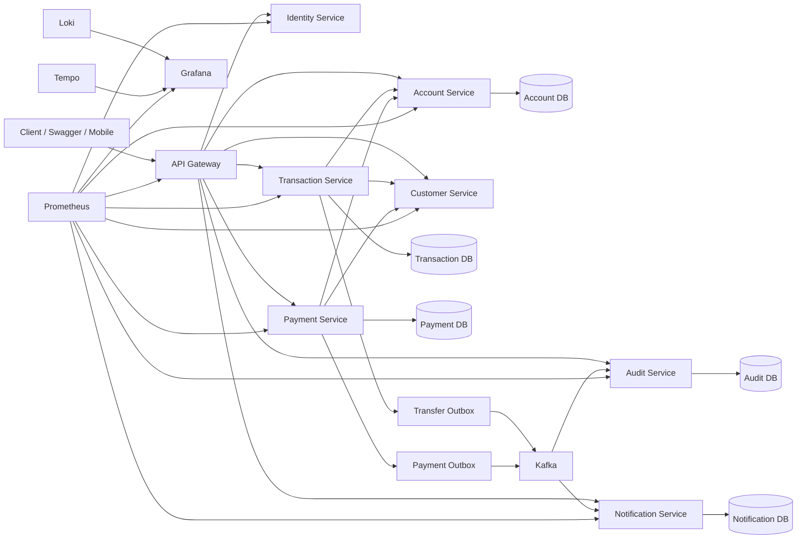
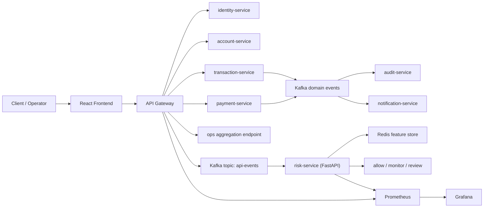

# Gateway Pattern Banking Platform

Production-style digital banking platform built to teach how a serious microservice system is designed, secured, observed, tested, and explained.

## Why This Repository Exists

Most gateway and microservice tutorials stop at CRUD and a reverse proxy. Real companies do not.

This project is intentionally shaped like a small banking platform so we can learn:

- where an `API Gateway` should help and where it should stay out of business logic
- how service boundaries protect ownership and reduce chaos
- why authentication, audit, idempotency, and traceability matter in financial systems
- how synchronous business calls and asynchronous domain events work together
- how observability, CI, and smoke validation turn code into an operable system

The goal is not to build a toy demo. The goal is to build a reference project that a hiring manager, senior engineer, or platform team can take seriously.

## What The Platform Does

The system currently supports:

- React frontend for client and operator workflows
- frontend production container image with Nginx SPA routing and API proxy
- login and JWT issuance through `identity-service`
- self-service account creation through `account-service`
- customer eligibility and KYC lookup through `customer-service`
- transfer orchestration with double-entry ledgering through `transaction-service`
- payment orchestration through `payment-service`
- asynchronous audit event consumption through `audit-service`
- asynchronous notification consumption through `notification-service`
- service-specific `PostgreSQL` persistence in Docker Compose mode
- `Kafka + Outbox Pattern` for safe domain event publication
- `Prometheus + Grafana + Tempo + Loki` for metrics, traces, and logs
- gateway-level `GET /api/v1/ops/platform-health` aggregation from `Actuator`, `Prometheus`, and `Kafka`
- Playwright E2E smoke tests for critical frontend journeys
- Kubernetes application-layer manifests for deployment handoff

## High-Level Architecture



## Service Boundaries

### `api-gateway`

Single client entry point.

Responsibilities:

- routing
- shared traffic policy
- token-aware edge behavior
- correlation propagation

### `identity-service`

Authentication boundary.

Responsibilities:

- username/password authentication
- JWT creation
- current-user resolution from bearer token

### `account-service`

Account and balance boundary.

Responsibilities:

- account creation
- account lookup
- IBAN ownership
- debit/credit posting

### `customer-service`

Customer eligibility boundary.

Responsibilities:

- customer profile
- KYC state
- risk rating
- transfer/payment eligibility support

### `transaction-service`

Transfer orchestration boundary.

Responsibilities:

- source account verification
- target IBAN verification
- transfer settlement initiation
- double-entry ledger records
- idempotency and rapid duplicate protection
- transfer domain event publication

### `payment-service`

Payment orchestration boundary.

Responsibilities:

- debtor account verification
- payment debit orchestration
- idempotency handling
- payment domain event publication

### `audit-service`

Compliance and audit boundary.

Responsibilities:

- audit feed
- security/event history
- asynchronous event consumption

### `notification-service`

User communication boundary.

Responsibilities:

- transfer/payment notification feed
- asynchronous event consumption

## Runtime Stack

### Business and Infrastructure

- `Spring Boot 4`
- `Spring Security`
- `Spring Data JPA`
- `PostgreSQL`
- `Kafka`
- `Docker Compose`

### Observability

- `Prometheus` for metrics collection
- `Grafana` for dashboards
- `Tempo` for traces
- `Loki` for logs
- `Promtail` for log shipping
- `OpenTelemetry` for distributed tracing

## Reference Roadmap

The project-finishing roadmap is organized into four phases:

- `Phase A: Runtime Proof`
  - end-to-end validation
  - dashboard provisioning
  - metrics, logs, and traces correlation
- `Phase B: Presentation Layer`
  - stronger README
  - architecture and demo storytelling
  - clearer onboarding and portfolio value
- `Phase C: Engineering Discipline`
  - CI pipeline
  - integration and service-level tests
  - smoke validation automation
- `Phase D: Advanced Platform`
  - optional Redis
  - resilience patterns
  - Kubernetes-oriented evolution

Detailed roadmap:

- [reference-roadmap.md](/Users/yvz.o/Desktop/projects/Geteway_Pattern/docs/architecture/reference-roadmap.md)
- [fazA-runtime-proof-spec.md](/Users/yvz.o/Desktop/projects/Geteway_Pattern/specs/fazA-runtime-proof-spec.md)
- [fazB-presentation-layer-spec.md](/Users/yvz.o/Desktop/projects/Geteway_Pattern/specs/fazB-presentation-layer-spec.md)
- [fazC-engineering-discipline-spec.md](/Users/yvz.o/Desktop/projects/Geteway_Pattern/specs/fazC-engineering-discipline-spec.md)
- [fazD-advanced-platform-spec.md](/Users/yvz.o/Desktop/projects/Geteway_Pattern/specs/fazD-advanced-platform-spec.md)

## Documentation Map

- [system-overview.md](/Users/yvz.o/Desktop/projects/Geteway_Pattern/docs/architecture/system-overview.md)
- [system-design.md](/Users/yvz.o/Desktop/projects/Geteway_Pattern/docs/architecture/system-design.md)
- [port-route-plan.md](/Users/yvz.o/Desktop/projects/Geteway_Pattern/docs/architecture/port-route-plan.md)
- [faz4-business-flows.md](/Users/yvz.o/Desktop/projects/Geteway_Pattern/docs/architecture/faz4-business-flows.md)
- [faz5-service-communication.md](/Users/yvz.o/Desktop/projects/Geteway_Pattern/docs/architecture/faz5-service-communication.md)
- [faz6-platform-runtime.md](/Users/yvz.o/Desktop/projects/Geteway_Pattern/docs/architecture/faz6-platform-runtime.md)
- [fazA-runtime-proof.md](/Users/yvz.o/Desktop/projects/Geteway_Pattern/docs/architecture/fazA-runtime-proof.md)
- [demo-scenario.md](/Users/yvz.o/Desktop/projects/Geteway_Pattern/docs/architecture/demo-scenario.md)
- [observability-investigation-playbook.md](/Users/yvz.o/Desktop/projects/Geteway_Pattern/docs/architecture/observability-investigation-playbook.md)
- [service-catalog.md](/Users/yvz.o/Desktop/projects/Geteway_Pattern/docs/architecture/service-catalog.md)
- [failure-scenarios.md](/Users/yvz.o/Desktop/projects/Geteway_Pattern/docs/architecture/failure-scenarios.md)
- [security-foundation.md](/Users/yvz.o/Desktop/projects/Geteway_Pattern/docs/security/security-foundation.md)
- [docs/adr](/Users/yvz.o/Desktop/projects/Geteway_Pattern/docs/adr)

## Quick Start

### 1. Build service jars

Each service is an independent Maven project. Package the jars before starting Docker Compose.

### 2. Start the platform

```bash
/usr/local/bin/docker compose -f infra/docker/docker-compose.yml up -d --build
```

### 3. Open the main UIs

- [React Frontend](http://localhost:5173)
- [Grafana](http://localhost:3000)
- [Prometheus](http://localhost:9090)
- [Gateway Health](http://localhost:8090/actuator/health)
- [Platform Health Aggregation](http://localhost:8090/api/v1/ops/platform-health)
- [Identity Swagger](http://localhost:8081/swagger-ui/index.html)
- [Account Swagger](http://localhost:8082/swagger-ui/index.html)
- [Customer Swagger](http://localhost:8083/swagger-ui/index.html)
- [Transaction Swagger](http://localhost:8084/swagger-ui/index.html)
- [Payment Swagger](http://localhost:8085/swagger-ui/index.html)
- [Audit Swagger](http://localhost:8086/swagger-ui/index.html)
- [Notification Swagger](http://localhost:8087/swagger-ui/index.html)

### 4. Run the banking smoke test

```bash
/bin/zsh infra/local/phase6-banking-smoke-test.sh
```

### 5. Run the runtime-proof check

```bash
/bin/zsh infra/local/phaseA-runtime-proof.sh
```

### 6. Run the frontend locally

```bash
cd frontend
pnpm install
pnpm msw:init
pnpm dev --host 127.0.0.1
```

The frontend is configured by `frontend/.env.local`.

- `VITE_USE_MOCKS=false` connects the UI to the real API Gateway.
- `VITE_API_GATEWAY_URL=http://localhost:8090` points the browser to the backend.

### 7. Run frontend checks

```bash
cd frontend
pnpm typecheck
pnpm build
pnpm e2e
```

The E2E suite uses `frontend/.env.e2e`, so it can validate the UI flow against mock data without requiring the full backend stack.

### 8. Build the frontend container

```bash
docker build -t banking-platform/frontend:latest frontend
```

### 9. Review Kubernetes manifests

```bash
kubectl apply --dry-run=client -f infra/k8s/base
```

The Kubernetes manifests are application-layer deployment artefacts. They assume managed PostgreSQL, Kafka, and observability services are provided by the target platform.

## Operator Platform Health

The operator screen reads:

```text
GET /api/v1/ops/platform-health
```

That endpoint is intentionally owned by `api-gateway` because it is a platform-level aggregation endpoint, not a business capability owned by one domain service.

It combines:

- `Spring Boot Actuator` health for service reachability
- `Prometheus` queries for request rate, latency percentile, uptime, and error rate
- `Kafka AdminClient` consumer group lag for async consumers

If Prometheus or Kafka is temporarily unavailable, the endpoint still answers with Actuator fallback data instead of breaking the operator UI.

## Security Event Stream

The `api-gateway` publishes one API security event for every completed gateway request.
Events are sent to Kafka topic `api-events` and form the data foundation for the risk-service.

Topic:

```text
api-events
```

Event contract:

```json
{
  "eventId": "b4f8d8c6-94d1-4e34-a3a6-4e08391f3f5f",
  "timestamp": "2026-04-26T10:15:30.123Z",
  "correlationId": "3b41b6e5-7395-4d0f-8e32-7dfd75d4fd4b",
  "userId": "cust-1002",
  "username": "yavuz",
  "role": "CUSTOMER",
  "ipAddress": "127.0.0.1",
  "userAgent": "Mozilla/5.0 ...",
  "endpoint": "/api/v1/accounts/me",
  "httpMethod": "GET",
  "statusCode": 200,
  "responseTimeMs": 34,
  "serviceName": "api-gateway"
}
```

Why it exists:

- it turns live API traffic into a security data stream
- it keeps request identity, endpoint, status, latency, and correlation metadata together
- it gives the risk-service a stable event contract
- it supports auditability without putting risk logic inside the gateway

## Risk Service

The `risk-service` is a Python FastAPI service that consumes gateway API events from Kafka and produces an explainable risk decision.
It uses Redis as a real-time feature store so each decision can include recent behavior, not only the current request.
In this phase it observes and evaluates traffic only; it does not block gateway requests yet.

Runtime endpoints:

```text
GET  /health
GET  /risk/stats
GET  /risk/decisions?limit=25
POST /risk/evaluate
```

Local URLs:

```text
http://localhost:8091/health
http://localhost:8091/risk/stats
http://localhost:8091/risk/decisions?limit=10
```

Initial decision levels:

```text
allow   -> normal request
monitor -> elevated but not critical
review  -> suspicious enough for operator review
```

The first rule-based scoring layer considers:

- HTTP status code
- gateway response time
- anonymous access to non-actuator endpoints
- sensitive banking endpoints such as accounts, transactions, payments, and ops
- request frequency in the last 1 and 5 minutes
- failed request count in the last 5 minutes
- endpoint diversity per user
- distinct IP count per user
- distinct user count per IP
- rapid repeat requests
- off-hours sensitive access

Redis feature keys are TTL-based and intentionally short-lived. This keeps the system fast and privacy-aware for local demo purposes.

Why it exists:

- it separates security analysis from request routing
- it lets Java microservices keep business ownership while Python owns risk intelligence
- it creates a clear extension point for ML anomaly detection and adaptive gateway response in later phases
- it keeps decisions explainable, which matters for banking audit and compliance-aware systems

## Demo Story

The strongest demo path is:

1. login as `yavuz`
2. create Yavuz account
3. login as `fatih`
4. create Fatih account
5. transfer from Yavuz to Fatih using Fatih's real IBAN
6. create a payment from Fatih
7. verify audit and notification side effects
8. prove the traffic in Prometheus, logs in Loki, and traces in Tempo
9. switch to the React operator workspace and confirm `Platform health` shows live gateway aggregation

Detailed walkthrough:

- [demo-scenario.md](/Users/yvz.o/Desktop/projects/Geteway_Pattern/docs/architecture/demo-scenario.md)

## Five-Minute Demo Flow

Use this flow when presenting the project quickly:

1. Start the Docker Compose runtime and show all core containers are up.
2. Open the React client workspace and sign in through Helvetiq SSO.
3. Create or inspect accounts, then perform a transfer from the `Move money` screen.
4. Open Prometheus or Grafana to show the platform is observable.
5. Switch to the React operator workspace and show `Platform health`.
6. In the same operator screen, show `Security decisions` from the risk-service.
7. Explain that API Gateway traffic becomes Kafka events, the Python risk-service consumes them, Redis keeps short-lived behavior features, and each request receives an explainable risk decision.

## Runtime Architecture



## Security Decision Demo

The operator UI reads recent risk decisions from:

```text
GET http://localhost:8091/risk/decisions?limit=8
```

Example decision:

```json
{
  "endpoint": "/api/v1/accounts/me",
  "riskScore": 0.30,
  "decision": "monitor",
  "topFactors": ["elevated_request_frequency", "rapid_repeat_request"],
  "features": {
    "requestCount1m": 12,
    "failedRequestCount5m": 0,
    "source": "redis"
  }
}
```

This demonstrates that the platform does not only process banking requests. It also observes API behavior, extracts real-time security features, and produces explainable risk decisions that an operator can inspect.

## Why Companies Use These Patterns

### `API Gateway`

Companies use a gateway to centralize traffic entry, enforce shared policy, and keep client-facing routing simple.

### `Database per Service`

Companies use service-owned databases to protect ownership and reduce accidental cross-team coupling.

### `Outbox Pattern`

Companies use outbox to avoid the dangerous case where business data is saved but the domain event is lost.

### `Idempotency`

Companies use idempotency to stop duplicate transfers or payments when users double-click or clients retry after timeouts.

### `Observability`

Companies use metrics, logs, and traces together because production incidents are rarely solved from one signal alone.

## Repository Structure

```text
Geteway_Pattern/
  docs/
    adr/
    architecture/
    security/
  infra/
    docker/
    k8s/
    local/
  services/
    api-gateway/
    identity-service/
    customer-service/
    account-service/
    transaction-service/
    payment-service/
    audit-service/
    notification-service/
```

## Key Terms

### `API Gateway`

The front door of the system. Clients talk to this first.

### `Microservice`

A service that owns one clear responsibility and can evolve independently.

### `Service Boundary`

The explicit line that says what a service owns and what it does not own.

### `Authentication`

Verifying who the caller is.

### `Authorization`

Checking what an authenticated caller is allowed to do.

### `Audit`

Keeping trustworthy records of critical actions.

### `Idempotency`

Making the same request safe to repeat without duplicating money movement.

### `Observability`

Understanding a running system through metrics, logs, and traces.

## Engineering Rules

- keep business logic out of the gateway
- document architectural decisions
- design for auditability and traceability
- prefer reproducible automation over manual steps
- treat the README as part of the product

Repository-level engineering rules:

- [CLAUDE.md](/Users/yvz.o/Desktop/projects/Geteway_Pattern/CLAUDE.md)
