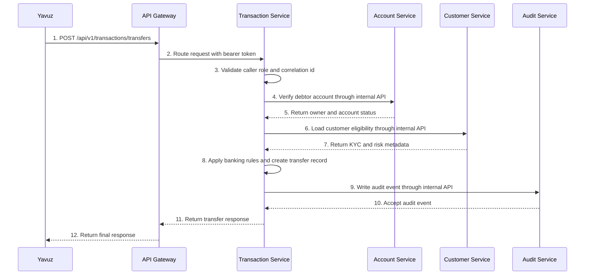
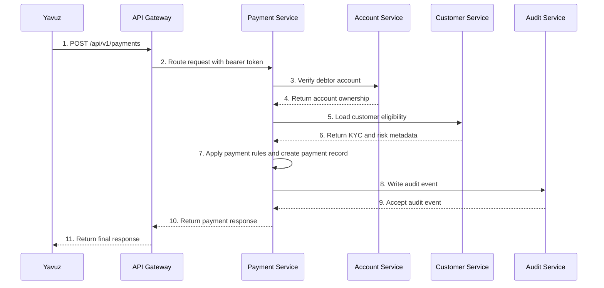

# Synchronous Service-to-Service Communication

## Purpose

This document describes the initial synchronous orchestration flow in the banking platform.

Phase 4 proved that multiple protected business services could answer meaningful requests through the gateway.

Phase 5 goes one level deeper:

- `transaction-service` now calls downstream services before creating a transfer
- `payment-service` now calls downstream services before creating a payment
- `audit-service` now accepts internal audit writes from other services
- `account-service` lets authenticated users create additional accounts for local development and testing

## Architecture

In microservice systems, a service often needs information owned by another service.

That does not mean we should copy all data everywhere.

Instead, we create a controlled `service-to-service communication` path.

`Service-to-service communication` means one backend service calling another backend service directly to complete a business flow.

## Transfer Flow

## Payment Flow

## Terms

### `Synchronous call`
A direct request-response call where one service waits for the other service before continuing.

### `Downstream service`
A service being called by another service during a flow.

### `Orchestration`
One service coordinating multiple steps in a business process.

### `Timeout`
The maximum time a service will wait for a downstream call.

### `Retry`
Trying the same downstream call again after a temporary failure.

### `Correlation propagation`
Passing the same `X-Correlation-Id` through all services so one user request can be traced end to end.

### `Internal API`
A backend-only API meant for service-to-service use, not for direct public clients.

## Operational Impact

This is the first phase where the platform behaves like a distributed banking system instead of a set of isolated APIs.

That is a major milestone because most production complexity in microservices comes from the space between services, not only from the code inside each service.

The platform is no longer limited to seeded accounts; new accounts can be created through Swagger to validate downstream ownership checks.
