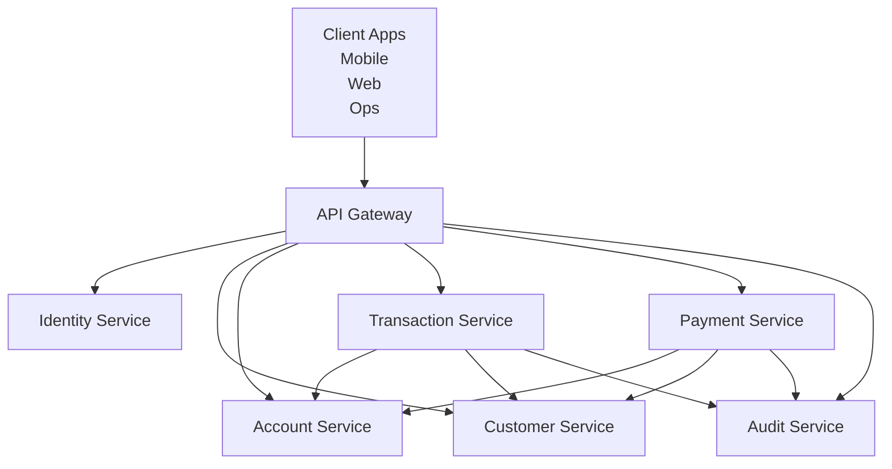
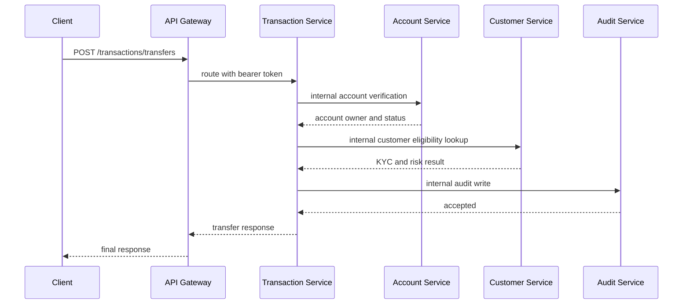

# System Design

## Goal

This document gives the more detailed system-level view of the banking platform.

It is the technical companion to the simpler system overview document.

## High-Level Runtime Design

## Why This Shape Fits Banking

Banking systems usually separate responsibilities because different concerns have different risk profiles.

- login and token flows are security critical
- account data is balance critical
- transaction history is audit critical
- payments are duplicate-sensitive
- audit records are compliance critical

If these responsibilities are mixed too early, it becomes difficult to reason about ownership and risk.

## Intended Request Flow

## Important Terms

### `Verified identity`
An identity that has passed authentication and is trusted by the platform.

### `Routing contract`
The rule set that decides which path goes to which backend service.

### `Boundary ownership`
The idea that each service owns a clear area of the system.

## Phase 5 Scope

In Phase 5, the architecture becomes meaningfully distributed.

That means:

- transaction and payment flows no longer rely only on local in-memory ownership checks
- business services call downstream internal APIs synchronously
- timeout, retry, and correlation propagation are part of the runtime behavior
- audit writes are produced as part of the orchestration path

This is still not the final production model, but it now behaves like a real microservice foundation with visible cross-service coordination.
