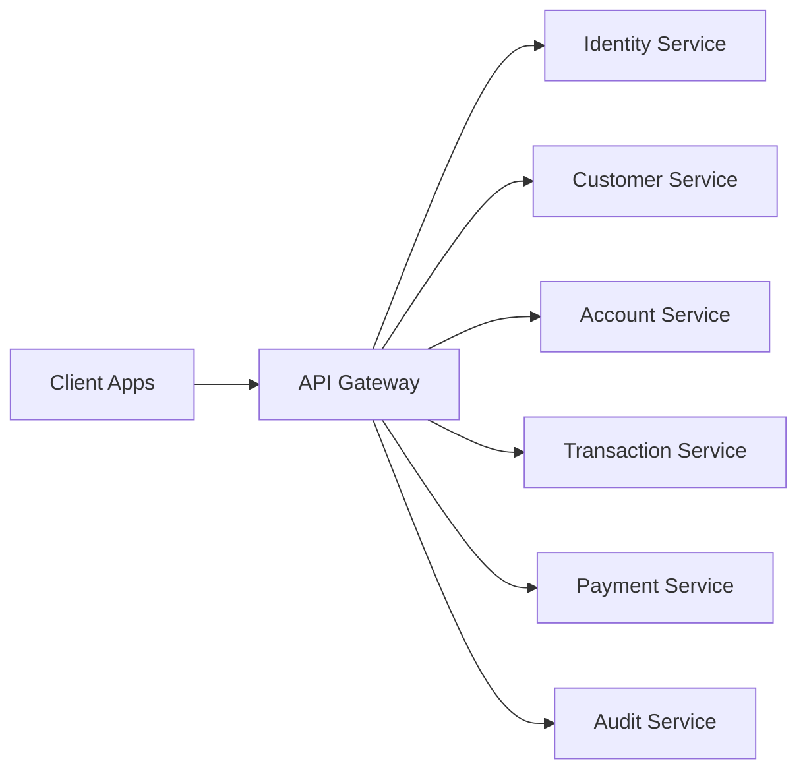

# System Overview

## Purpose

This document explains the high-level architecture of the banking platform.

It answers three questions:

1. What are we building?
2. Why is it split this way?
3. How does a request move through the system?

## High-Level Architecture

## Why We Use This Shape

In a bank, different parts of the platform change at different speeds and carry different risks.

Examples:

- identity and login are security-heavy
- accounts and balances are data-critical
- payments need duplicate protection
- audit data must be trustworthy and reviewable

A single large codebase can hide these boundaries. Clear services make them visible.

## Request Flow

The basic request path is:

1. client sends request to `api-gateway`
2. gateway validates access rules
3. gateway routes to the correct backend service
4. backend service processes business logic
5. response returns through the gateway

## Gateway Responsibility

The gateway owns traffic concerns, not banking business rules.

Gateway concerns:

- routing
- authentication checks
- authorization checks later
- centralized request policies
- cross-cutting concerns like correlation IDs

Things that should not live in the gateway:

- balance calculation
- transfer rules
- payment business decisions
- customer domain logic

## Service Boundary Summary

### `identity-service`
Owns login and token lifecycle.

### `customer-service`
Owns customer profile data.

### `account-service`
Owns account records and balances.

### `transaction-service`
Owns transfer and ledger behavior.

### `payment-service`
Owns payment-specific workflows.

### `audit-service`
Owns audit-grade event records.

## Terms

### `Cross-cutting concern`
A concern shared by many services, like security, logging, tracing, or rate limiting.

### `Routing`
Sending a request to the correct downstream service.

### `Downstream service`
The backend service behind the gateway that actually handles the request.

### `Single entry point`
One official entrance into the platform. In this project, that is the gateway.
